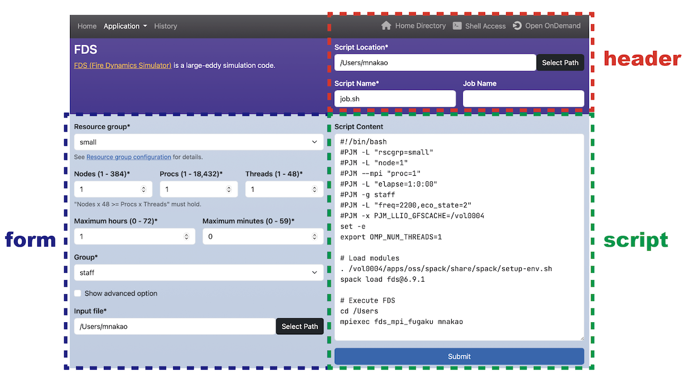
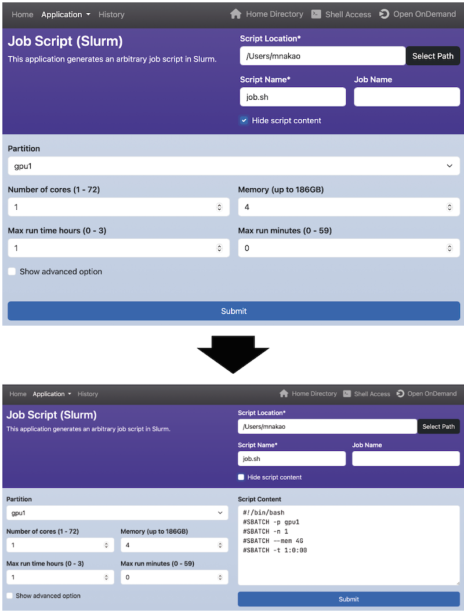

## 概要
1. すべてのアプリケーションの保存するためのディレクトリ名を`./conf.yml.erb`の`apps_dir`に記入します。ここでは、`apps_dir: ./apps`とします。
2. `./apps/`以下にアプリケーション用のディレクトリを作成します。アプリケーション名を`test`とした場合、`./apps/test`を作成します。
3. 下記の設定ファイルを作成します。Embedded Ruby形式で作成する場合は、各ファイル名を`form.yml.erb`と`manifest.yml.erb`にしてください。
- `./apps/test/form.yml`：Webフォームの設定
- `./apps/test/manifest.yml`：アプリケーションの説明

## form.ymlの設定
`form.yml`は、`form`、`header`、`script`、`check`、`submit`というキーで構成されており、それぞれメインウィジット、ヘッダウィジット、ジョブスクリプト、チェックスクリプト、ジョブ投入時の前処理を定義します。`form`と`script`は必須項目ですが、`header`、`check`、`submit`は省略できます。

次の図は`form`、`header`、`script`の担当範囲を示しています。`form`と`header`と`script`からジョブスクリプトが生成されます。`header`を省略した場合は`./lib/header.yml.erb`が代わりに利用されます（ほとんどの場合、`header`を`form.yml`で定義する必要はないでしょう）。なお、左上のアプリケーションの説明などは`manifest.yml`の担当範囲です。



`check`はウィジットに設定された値のチェックをジョブの投入前に行います。`submit`はジョブスケジューラにジョブを投入する際の前処理を定義します。

### widget: number
数値の入力欄を表示します。下の例の`nodes`はウィジットの変数名です。`label`はラベル、`value`は初期値、`min`は最小値、`max`は最大値、`step`はステップ幅です。`required`は必須であるかどうかを指定します。`help`は入力欄の下に表示されるヘルプメッセージです。ジョブスクリプトには`script`内の文字列が表示されます。`script`の中の`#{nodes}`は入力した値に置き換えられます。

```
form:
  nodes:
    widget:   number
    label:    Number of nodes (1 - 128)
    value:    4
    min:      1
    max:      128
    step:     1
    required: false
    help:     The larger the number, the longer the wait time.
    
script: |
  #SBATCH --nodes=#{nodes}
```

複数の数値の入力欄を表示することもできます。その場合、`size`で入力欄の数を記述し、各項目を配列形式で記述します。`script`の`#{time_1}`と`#{time_2}`は、1つ目と2つ目に入力した値に置き換えられます。

```
form:
  time:
    widget: number
    label:  [ Maximum run time (0 - 24 h), Maximum run time (0 - 59 m) ]
    size:   2
    value:  [  1,  0 ]
    min:    [  0,  0 ]
    max:    [ 24, 59 ]
    step:   [  1,  1 ]
    
script: |
  #SBATCH --time=#{time_1}:#{time_2}:00
```


`label`が配列形式ではない場合、一行の長いラベルを記述することができます。`help`も同様です。

```
form:
  time:
    widget: number
    label:  Maximum run time (0 - 24 h, 0 - 59 m)
    size:   2
    value:  [  1,  0 ]
    min:    [  0,  0 ]
    max:    [ 24, 59 ]
    step:   [  1,  1 ]
```


項目ごとのラベルと一行の長いラベルを記述することもできます。配列形式の最初の要素に長いラベルを、2つ目の要素を配列形式で記述ください。

```
form:
  time:
    widget: number
    label:  [Maximum run time, [0 - 24 h, 0 - 59 m]]
    size:   2
    value:  [  1,  0 ]
    min:    [  0,  0 ]
    max:    [ 24, 59 ]
    step:   [  1,  1 ]
```


ジョブスクリプトのラベル（デフォルトは「Script Content」）を変更したい場合は`script`に対して`label`を設定します。その場合、ジョブスクリプトは`content`に記述します。

```
script:
  label: Script Details
  content: |
    #SBATCH --nodes=#{nodes}
```

`check`では、Rubyスクリプトと関数`oc_assert(condition, message)`を利用できます。この関数は`condition`が`false`の場合、`message`を出力して処理を終了します。下記のサンプルでは、24時間よりも大きな値が入力された状態で「Submit」ボタンをクリックすると、エラーメッセージが出力され、ジョブスクリプトの投入は行わないことを意味しています。`form`の変数を参照する場合は、@マークの後に変数名を記述してください。なお、すべての変数は文字列であることに注意ください。

`check`では、下記の特殊な変数も利用できます。
- @OC_APP_NAME : `manifest.yml`の`name`で定義しているアプリケーション名
- @OC_APP_PATH : `form.yml`が保存されているアプリケーションのパス（例：`/Slurm`）
- @OC_SCRIPT_LOCATION : ヘッダで定義されている`Script Location`
- @OC_SCRIPT_NAME : ヘッダで定義されている`Script Name`
- @OC_JOB_NAME :ヘッダで定義されている`Job Name`

```
form:
  time:
    widget: number
    label:  [ Maximum run time (0 - 24 h), Maximum run time (0 - 59 m) ]
    size:   2
    value:  [  1,  0 ]
    min:    [  0,  0 ]
    max:    [ 24, 59 ]
    step:   [  1,  1 ]

script: |
  #SBATCH --time=#{time_1}:#{time_2}:00
  
check: |
  time_1 = @time_1.to_i
  time_2 = @time_2.to_i
  message = "Exceeded Time"
  oc_assert(time_1 != 24 || time_2 == 0, message)
```

`submit`のサンプルは下記の通りです。シェルスクリプトで記述します。`form`の変数を参照する場合は、`form`と同様に`#{...}`を利用してください。環境変数`OC_SUBMIT_OPTIONS`は、ジョブスクリプト投入コマンドに追加のオプションを設定できます。この処理の実行後に、ジョブスクリプトを投入するためのコマンド（例えば、sbatch #{OC_SUBMIT_OPTIONS} -J #{OC_JOB_NAME} #{OC_SCRIPT_NAME}）が実行されます。

```
submit: |
  #!/bin/bash

  cd #{OC_SCRIPT_LOCATION}
  mv #{OC_SCRIPT_NAME} param.conf
  genjs_ct param.conf > #{OC_SCRIPT_NAME}
  OC_SUBMIT_OPTIONS="-n 1"
```

### widget: text
テキストの入力欄を表示します。

```
form:
  comment:
    widget: text
    value: test
    label: Comment

script: |
  #SBATCH --comment=#{comment}
```

複数のテキストの入力欄を1行で表示することも可能です。

```
form:
  option:
    widget: text
    value: [ --comment=, test ]
    label: [ option, argument ]
    size: 2

script: |
  #SBATCH #{option_1}#{option_2}
```

### widget: email
`widget: text`とほぼ同じですが、「Submit」ボタンをクリックする際にメールアドレスの形式がチェックされます。

```
form:
  email:
    widget: email
    label:  Email
    
script: |
  #SBATCH --mail-user=#{email}
```

### widget: select
セレクトボックスをウィジットに表示します。`options`に選択肢を配列形式で記述します。配列の1つ目の要素はセレクトボックスの項目名です。`script`の`#{partition}`は`options`の2つ目の要素に置き換えられます。

```
form:
  partition:
    widget: select
    label: Partition
    value: Large Queue
    options:
      - [ Small Queue, small ]
      - [ Large Queue, large ]
      
script: |
  #SBATCH --partition=#{partition}
```

`options`の2つ目の要素は配列で記述することも可能です。下記の例では、`script`の`#{package_1}`と`#{package_2}`は、配列の第1要素と第2要素に置き換えられます。後述の`widget: multi_select`、`widget: radio`、`widget: checkbox`でも可能です。

```
form:
  package:
    widget: select
    label: Select package
    options:
      - [A, [packageA, a.out]]
      - [B, [packageB, b.out]]

script: |
  module load #{package_1}
  mpiexec #{package_2}
```

### widget: multi_select
複数の項目を選択できる入力欄を表示します。`options`に選択肢を記述します。

```
form:
  load_modules:
    widget: multi_select
    label: Add modules
    value: mpi/mpich-x86_64
    options:
      - [mpi/mpich-x86_64, mpi/mpich-x86_64]
      - [mpi/openmpi-x86_64, mpi/openmpi-x86_64]
      - [nvhpc/24.3, nvhpc/24.3]
      - [nvhpc/24.5, nvhpc/24.5]
      - [nvhpc/24.7, nvhpc/24.7]

script: |
  module load #{load_modules}
```

例えば`mpi/mpich-x86_64`と`nvhpc/24.7`を選択した場合は、ジョブスクリプトは下記のように複数行で表示されます。

```
module load mpi/mpich-x86_64
module load nvhpc/24.7
```

1行で表示したい場合は、`separator`で区切り文字を設定します。

```
form:
  load_modules:
    widget: multi_select
    label: Add modules
    value: mpi/mpich-x86_64
    separator: " "
    options:
      - [mpi/mpich-x86_64, mpi/mpich-x86_64]
      - [mpi/openmpi-x86_64, mpi/openmpi-x86_64]
      - [nvhpc/24.3, nvhpc/24.3]
      - [nvhpc/24.5, nvhpc/24.5]
      - [nvhpc/24.7, nvhpc/24.7]
      
script: |
  module load #{load_modules}
```

選択された項目が、`separator`で設定した区切り文字を用いて1行で表示されます。

```
module load mpi/mpich-x86_64 nvhpc/24.7
```

`value`に複数の初期値を設定する場合は、配列形式で記述します。

```
form:
  load_modules:
    widget: multi_select
    label: Add modules
    value: [mpi/mpich-x86_64, nvhpc/24.7]
    options:
      - [mpi/mpich-x86_64, mpi/mpich-x86_64]
      - [mpi/openmpi-x86_64, mpi/openmpi-x86_64]
      - [nvhpc/24.3, nvhpc/24.3]
      - [nvhpc/24.5, nvhpc/24.5]
      - [nvhpc/24.7, nvhpc/24.7]
```

### widget: radio
ラジオボタンを表示します。`widget: select`とほぼ同じですが、`direction: horizontal`が設定可能です。`direction: horizontal`を設定すると水平方向にラジオボタンを表示できます。`direction: horizontal`がない場合は、垂直方向にラジオボタンを表示します。

```
form:
  jupyter:
    widget: radio
    label: Jupyter
    direction: horizontal
    value: Jupyter Lab
    options:
      - [ Jupyter Lab,      jupyterlab ]
      - [ Jupyter Notebook, jupyter    ]

script: |
  module load #{jupyter}
```

### widget: checkbox
チェックボックスを表示します。次のように`required`を配列形式で設定した場合、チェックボックスの各項目が必須かどうかを設定します。

```
form:
  mail_option:
    label: Mail option
    widget: checkbox
    direction: horizontal
    value: [ Fail of job,  When the job is requeued ]
    required: [true, false, true, false, false]
    options:
      - [ Beginning of job execution, BEGIN   ]
      - [ End of job execution,       END     ]
      - [ Fail of job,                FAIL    ]
      - [ When the job is requeued,   REQUEUE ]
      - [ All,                        ALL     ]

script: |
  #SBATCH --mail-type=#{mail_option}
```

次のように`required`が配列形式でない場合かつ値が`true`の場合、そのチェックボックスで1つ以上の項目がチェックがされていないとジョブの投入を行うことができない、という設定になります。

```
form:
  mail_option:
    label: Mail option
    widget: checkbox
    direction: horizontal
    value: [ Fail of job,  When the job is requeued ]
    required: true
    options:
      - [ Beginning of job execution, BEGIN   ]
      - [ End of job execution,       END     ]
      - [ Fail of job,                FAIL    ]
      - [ When the job is requeued,   REQUEUE ]
      - [ All,                        ALL     ]

script: |
  #SBATCH --mail-type=#{mail_option}
```

`widget: multi_select`と同様に`separator`の設定を行うことや、`widget: radio`と同様に`direction`の設定を行うことができます。

### widget: path
Open Composerが動作しているサーバ上のファイルやディレクトリのパスを選択できる機能です。`value`のデフォルトは`${HOME}`です。`show_files`はファイルを表示するかどうかのフラグであり、デフォルトは`true`です。`favorites`はショートカットパスを設定できます。

```
form:
  working_dir:
    widget: path
    label: Working Directory
    value: /work
    show_files: false
    favorites:
      - /fs/ess
      - /fs/scratch

script: |
  cd #{working_dir}
```

script中で利用できる関数として`dirname(FILE_PATH)`と`basename(FILE_PATH)`を提供しています。
ディレクトリ名とファイル名を含むパス名から、`dirname()`はディレクトリ部分を、`basename()`はファイル部分だけを返します。

```
form:
  input_file:
    widget: path
    label: Input file

script: |
  cd #{dirname(input_file)}
  mpiexec ./#{basename(input_file)}
```

### Dynamic Form Widget
`select`、`radio`、`checkbox`のウィジットである項目を選択すると、他のウィジットの設定を動的に変更できます。

### 最小値・最大値・ステップ幅・ラベル・値の設定
`options`の各配列の第3要素以降に`set-(min|max|step|label|value|required|help)-(KEY)[_(num|1st element in options)]:(VALUE)`を指定します。

次の例では、`node_type`で`Medium`を選択すると、`cores`のラベルと最大値は`Number of Cores (1-8)`と`8`になります。

```
form:
  node_type:
    widget: select
    label: Node Type
    options:
      - [ Small,  small ]
      - [ Medium, medium, set-label-cores: Number of Cores (1-8),  set-max-cores: 8  ]
      - [ Large,  large,  set-label-cores: Number of Cores (1-16), set-max-cores: 16 ]

  cores:
    widget: number
    label: Number of Cores (1-4)
    value: 1
    min: 1
    max: 4
    step: 1
```

`number`、`text`、`email`において複数の入力欄を作っていた場合、設定対象の入力欄の指定に`_(num)`を用います。次の例では、`node_type`で`GPU`を選択すると、`time`の1つ目の入力欄のラベルと最大値が`Maximum run time hours (0 - 24)`と`24`になります。

```
form:
  node_type:
    widget: select
    label: Node Type
    options:
      - [ 'Standard', '' ]
      - [ 'GPU',      '', set-label-time_1: Maximum run time (0 - 24h), set-max-time_1: 24 ]

  time:
    widget:  number
    label:   [ Maximum run time (0 - 72 h), Maximum run time (0 - 59 m) ]
    size:    2
    value:   [  1,  0 ]
    max:     [ 72, 59 ]
    min:     [  0,  0 ]
    step:    [  1,  1 ]
```

`select`、`radio`、`checkbox`の場合、設定対象のオプションの指定に`1st element in options`を用います。次の例では、`node_type`で`GPU`を選択すると、`enable_gpu`の`Enable GPU`がチェックされます。

```
form:
  node_type:
    widget: select
    label: Node Type
    options:
      - [ 'Standard', '' ]
      - [ 'GPU',      '', set-value-enable_gpu: Enable GPU ]

  enable_gpu:
    widget: checkbox
    options:
      - [ Enable GPU, gpu ]
```

### ウィジットとオプションの無効化・有効化
`options`の各配列の第3要素以降に`[disable|enable]-(KEY)[-(1st element in options)][_num]`を指定します。

次の例では`cluster`で`Fugaku`を選択すると、`node_type`の`GPU`のオプションと`cuda_ver`のウィジットが無効化されます。キーを無効化された場合は、そのキーを利用している`script`中の行も削除されます。

```
form:
  cluster:
    widget: select
    label:  Cluster system
    options:
      - [ Fugaku,  fugaku, disable-node_type-GPU, disable-cuda_ver ]
      - [ Tsubame, tsubame ]

  node_type:
    widget: select
    label:  Node type
    options:
      - [ Standard, standard ]
      - [ GPU,      gpu      ]

  cuda_ver:
    widget: number
    label: CUDA version
    value: 12
    min: 12
    max: 14

script: |
  module load system/#{node_type}
  module load cuda/#{cuda_ver}
```

### ウィジットの非表示化
`options`の各配列の第3要素以降に`[hide|show]-(KEY)`を指定します。次の例では、`hide_advanced_options`をチェックすると`comment`が非表示になります。無効化とは異なり、そのキーのウィジットが表示されないだけであり、そのキーを利用している`script`の行には影響しません。`indent`はWebフォームの左側にインデントを作成します。数値は1〜5が入力でき、数値が大きくなるほどインデント幅は大きくなります。

```
form:
  hide_advanced_option:
    widget: checkbox
    options:
      - [ 'Hide advanced option', '', hide-comment ]

  comment:
    widget: text
    label: Comment
    indent: 1

script: |
  #SBATCH --comment=#{comment}
```

次の例では、`show_advanced_options`をチェックすると`comment`が表示されます。

```
form:
  show_advanced_options:
    widget: checkbox
    options:
      - [ 'Show advanced option', '', show-comment ]

  comment:
    widget: text
    label: Comment
    indent: 1

script: |
  #SBATCH --comment=#{comment}
```

### ウィジットと利用可能なオプションとの組合せ

| Widget | label<br>value<br>required<br>help<br>indent |  options<br>(Dynamic Form Widget) | size  | separator | direction | min<br>max<br>step| show_files<br>favorites |
| ---- | ---- | ----  | ---- | ---- | ---- |  ----  |  ---- |
| number | ○ | | ○ | | | ○| | 
| text<br>email | ○ |  | ○ | | |  | | 
| select | ○ |  ○ (○) | | | | | | 
| multi_select | ○ | ○ | | ○|  | |
| radio | ○ |  ○ (○)| | |○ | | | 
| checkbox | ○ |  ○ (○) | | ○| ○|  | | 
| path | ○ |  | | || | ○ | 

`options`のみは必須項目ですが、他の項目は省略可能です。

### ジョブスクリプトを隠す

ジョブスクリプトを隠すことができます。特殊な変数`SCRIPT_CONTENT`とDynamic Form Widgetの`hide-`とを下記のように組み合せて利用します（ERBであるため、ファイル名は`form.yml.erb`であることに注意ください）。

```
form:
  script_content:
    widget: checkbox
    value: "Hide script content"
    options:
      - ["Hide script content", "", hide-<%= SCRIPT_CONTENT %>]
```



チェックボックスを表示させずに、ジョブスクリプトを隠したい場合は、そのチェックボックスに対して`hide-`を設定します。

```
form:
  script_content:
    widget: checkbox
    value: "Hide script content"
    options:
      - ["Hide script content", "", hide-<%= SCRIPT_CONTENT %>, hide-script_content]
```

### headerの設定
`form.yml`と同じウィジットを用いることができます。ただし、`lib/headers.yml.erb`で定義されているウィジットは必ず同じ名前で定義してください。

下記の例は、定義されているウィジット（`_script_location`と`_script`）に、ジョブスクリプトを隠す新しいウィジット`script_content`を追加しています。

```
header:
  _script_location:
    widget:     path
    value:      <%= Dir.home %>
    label:      Script Location
    show_files: false
    required:   true

  _script:
    widget:   text
    size :    2
    label:    [Script Name, Job Name]
    value:    [job.sh, ""]
    required: [true, false]

  script_content:
    widget: checkbox
    value: "Hide script content"
    options:
      - ["Hide script content", "", hide-<%= SCRIPT_CONTENT %>]
```


## manifest.ymlの設定
アプリケーションの説明を記述します。サンプルは下記の通りです。

```
name: Gaussian
category: Quantum Chemistry
icon: icon.png
description: |
  [Gaussian](https://gaussian.com) is a general purpose computational chemistry software package.
related_app:
  - OVITO: ovito.png
  - GrADS: bi-airplane-fill
  - ImageJ
```

- name: アプリケーション名（このキーを省略した場合はディレクトリ名が代わりに用いられます）
- category：カテゴリ名
- icon: アイコンのための画像ファイルへのパス。URL、[Bootstrapアイコン](https://icons.getbootstrap.com/)、[Font Awesomeアイコン](https://fontawesome.com)も利用可能です。Bootstrapアイコンの場合は`icon: bi-airplane-fill`のように記述します。Font Awesomeアイコンの場合は`icon: fa-solid fa-gear`のように記述します
- description: アプリケーションの説明
- related_app: 後処理などを行う場合、Open OnDemandに登録されているアプリケーションを指定します。指定されたアプリケーションは履歴ページで表示されます。`icon:`と同様にアイコン画像などの指定が可能です。画像の指定がない場合は、Open OnDemandに登録されている画像が用いられます。

## 補足
- ウィジット名に利用できるのは英数字とアンダースコア（`_`）のみです。また、数字とアンダースコアを先頭に用いることもできません。
  - アプリケーションを保存するディレクトリ名も同様です。
  - 末尾がアンダースコア+数字のウィジット名（例：`nodes_1`）は、`size`の属性を持つウィジットの値を参照するときに衝突する可能性があるので注意ください。
  - `header`を`form.yml`で定義する場合、`lib/header.yml.erb`で用いられているアンダースコアで始まるウィジット名（`_script_location`と`_script`）は利用可能です。
- `options`で2つ目の要素がない場合、1つ目の要素が代わりに用いられます。
- `script`において、ある行で利用されている変数が値を持たない場合、その行は表示されません。ただし、その変数の先頭にコロンを付加する（例：`#{:nodes}`や`#{basename(:input_file)}`）と、その変数が値を持たなくても行は出力されます。
- Open Composerがジョブスクリプトをジョブスケジューラに投入するまでに行われる処理の順番は下記の通りです。
  1. アプリケーションページで「Submit」ボタンがクリックされる
  2. `form.yml`の`check`に記述されたスクリプトを実行（`check`がある場合）
  3. `form.yml`の`submit`に記述されたスクリプトを実行（`submit`がある場合）
  4. ジョブスケジューラにジョブスクリプトが投入される
